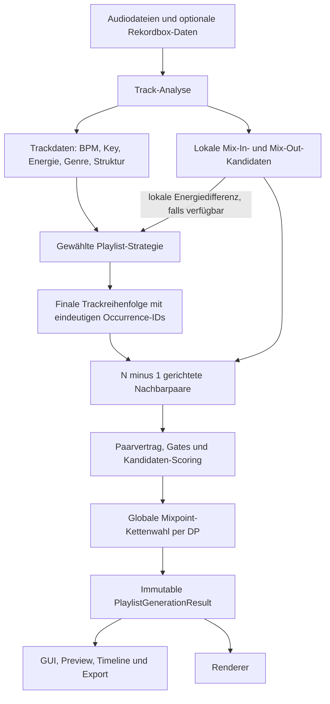
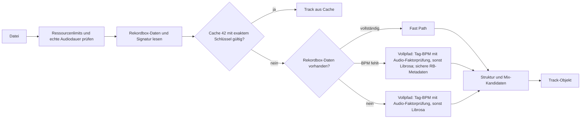
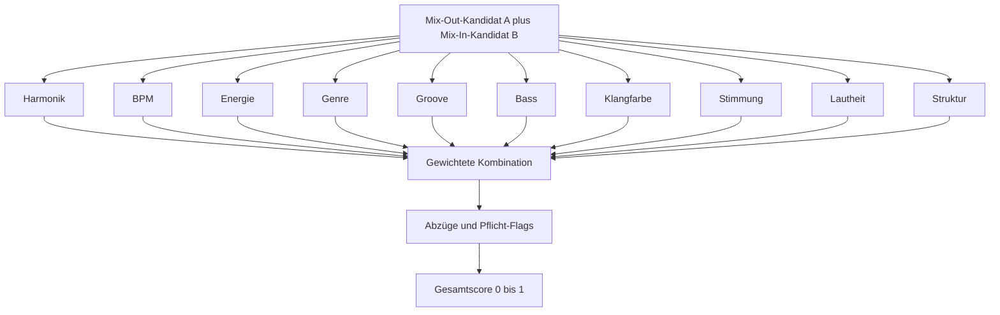
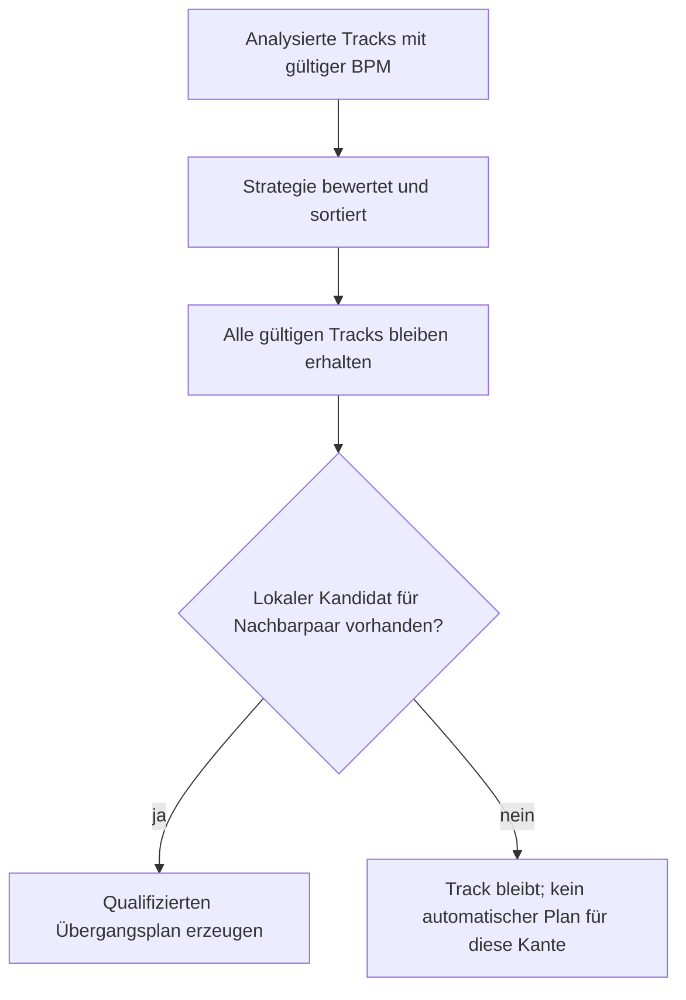
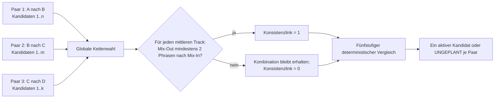
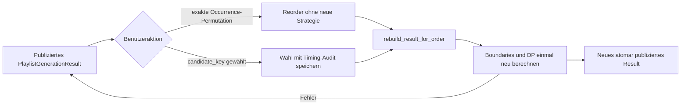
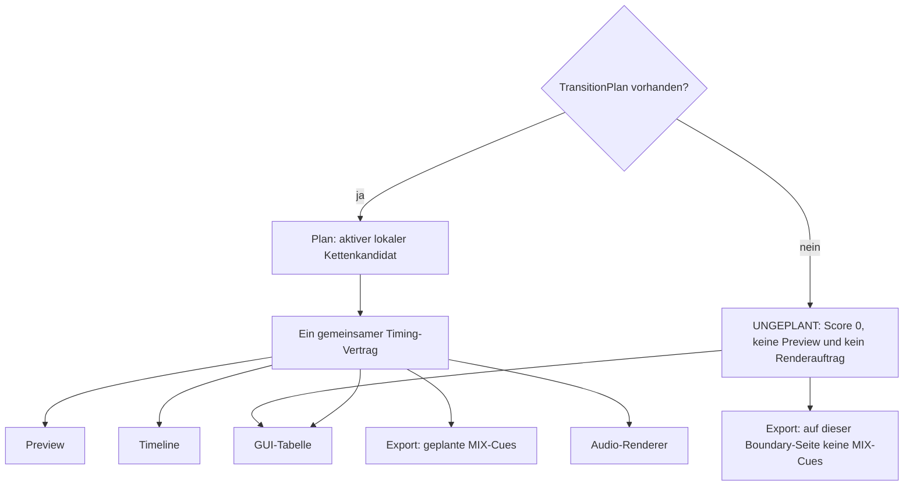
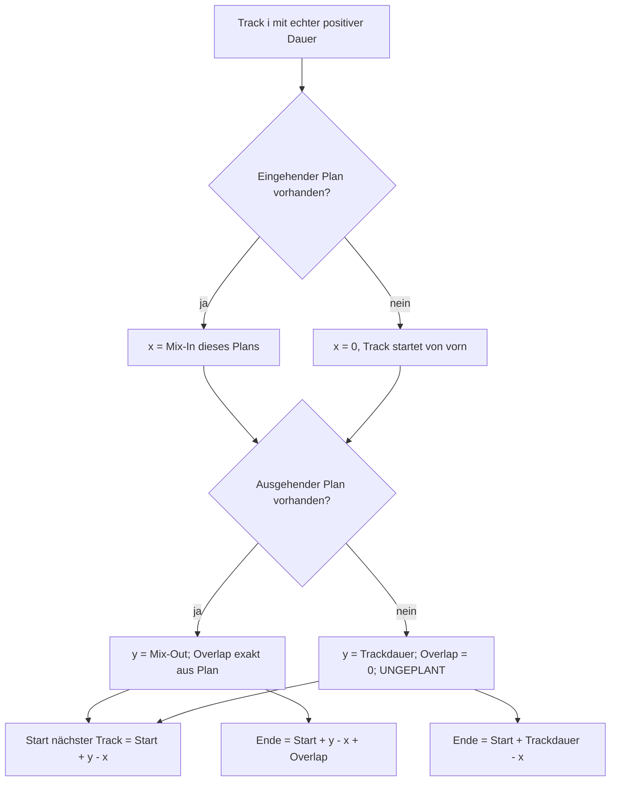

# Trackauswahl und Mixpoint-Bestimmung in HPG

Stand: 27. August 2026, abgeleitet aus dem aktuellen Code (Cache-Version 43).

Dieses Dokument erklärt zwei getrennte Entscheidungen:

1. **Trackauswahl:** Welcher Track folgt auf welchen?
2. **Mixpoint-Auswahl:** An welchen Stellen von Track A und Track B findet dieser Übergang statt?

Die Analyse erzeugt pro Track lokale Mix-In- und Mix-Out-Kandidaten. Beim Ordnen der Tracks bewertet HPG eine gerichtete Trackkante jedoch mit einem eigenen Acht-Faktoren-Score. Falls ein lokaler Rang-1-Kandidat existiert, liefert er dafür nur die lokale Energiedifferenz und sichtbare Detailwerte; sein Zehn-Faktoren-`PairCandidate.score` wird nicht als Sortierscore übernommen. Erst wenn die Reihenfolge feststeht, werden genau die `N - 1` gerichteten Nachbarpaare vollständig bewertet und ihre Mixpoints gemeinsam gewählt. Die ursprünglichen Analysewerte am `Track` werden dabei nicht nachträglich verändert; der tatsächlich verwendete Übergang lebt im `TransitionPlan`.

## Gesamtbild



## 1. Welche Daten werden pro Track ermittelt?

Die Analyse sammelt und normalisiert unter anderem:

- BPM,
- Tonart und Camelot-Code,
- Energie, Lautheit, Groove, Bassdruck, Klangfarbe und Stimmung,
- Genre und genreabhängige Phrasenlänge,
- erster Downbeat, Phrasenanker und Vertrauenswerte,
- Intro, Hauptteile, Breakdowns, Drops und Outro,
- manuelle Rekordbox-Cues, Beatgrid und PSSI-Phrasen, sofern verifiziert,
- mehrere mögliche Mix-In- und Mix-Out-Punkte mit Herkunft und Confidence.

Die effektive Direct/Half/Double-Tempo-Relation ist kein einzelner Analysewert
eines Tracks. Sie wird später gerichtet für ein konkretes Paar `A -> B` aus
den beiden BPM-Werten berechnet.

Es gibt zwei Analysepfade. Sind Rekordbox-Daten mit BPM vorhanden, werden sie
als schneller Metadatenpfad genutzt. Fehlt die Rekordbox-BPM, verwendet der
Vollpfad zuerst eine vorhandene BPM aus ID3-/AIFF-Tags und prüft deren Faktor
gegen Librosa; fehlt auch dieser Tag, bestimmt Librosa das Tempo. Die geprüften
Faktoren sind `0.5`, `2/3`, `3/4`, `1`, `4/3`, `1.5` und `2`. Eine Korrektur
ist nur zulässig, wenn das ID3-Genre einem bekannten kanonischen Genre
entspricht, der Tag außerhalb und das korrigierte Tempo innerhalb genau dessen
BPM-Bereichs liegt. Bei fehlendem oder unbekanntem ID3-Genre bleibt der
Tagwert unverändert; es gibt keinen genreübergreifenden Union-Fallback.

Artist, Titel und Genre werden feldweise zuerst aus Easy-Tags und bei dort
fehlenden Werten aus rohen `TPE1`-, `TIT2`- und `TCON`-Frames gelesen. Das gilt
auch für AIFF-Metadaten. Sichere Rekordbox-Metadaten bleiben im BPM-losen
Vollpfad erhalten. Ein widersprüchliches Beatgrid darf keinen unbelegten
Taktanker erzwingen: Dann wird auf den gemessenen Audio-Anker zurückgefallen.

Scheitert im Rekordbox-Fast-Path das tatsächliche Audio-Decoding, wird der
Track ausdrücklich als `rekordbox_degraded` markiert, nicht gecacht und vor
Limits, KI, Playlist und Export ausgeschlossen. Ein gemischter Lauf endet
sichtbar als partiell; sind alle Tracks betroffen, endet er mit einem konkreten
Analysefehler. Ersatzwerte gelangen damit nicht in das Scoring.



## 2. Wie wird die Trackreihenfolge bestimmt?

### 2.1 Eingangskontrolle

`generate_playlist_result` übernimmt die analysierten Tracks und die aktuellen GUI-Parameter. Tracks mit nicht numerischer, nicht endlicher oder nicht positiver BPM werden ausgeschlossen. Ein fehlender Key schließt einen Track nicht aus. Für die ältere Camelot-Kompatibilitätsbewertung gilt dann ein niedriger neutraler Fallback. Ein lokaler `PairCandidate` benötigt dagegen einen messbaren lokalen Camelot-Wert: Fehlt dessen Harmonikfaktor, verwirft `rank_pair_candidates` den Kandidaten. Der Track bleibt in der Playlist, die betroffene Kante kann dadurch aber `UNGEPLANT` bleiben.

Alte Strategienamen werden auf die aktuellen Namen abgebildet. Danach arbeitet genau eine der acht Strategien:

| Strategie | Hauptziel |
|---|---|
| Harmonic Flow | möglichst gute lokale Übergänge mit Lookahead |
| Warm-Up | BPM aufsteigend; bei exakt gleicher BPM vollständiger lokaler Übergangsscore mit Lookahead |
| Cool-Down | BPM absteigend; bei exakt gleicher BPM vollständiger lokaler Übergangsscore mit Lookahead |
| Peak-Time | Aufbau zum einstellbaren Peak, danach kontrollierter Verlauf |
| Energy Wave | wellenförmiger Energieverlauf |
| Genre Flow | Genregruppen und Genreähnlichkeit |
| Consistent | möglichst gleichmäßiger Verlauf |
| Context Flow | kombinierter Zielverlauf aus Energie, Peak, Genre und Harmonik |

Nur Parameter, welche die gewählte Strategie wirklich unterstützt, werden aktiv. Ein explizit übergebener alter oder partieller `scoring_context` wird zuerst gegen den vollständigen Laufvertrag ergänzt und validiert. Dieser fertige Snapshot wird danach unverändert an Qualitätsanzeige, Reorder, Übergangsempfehlungen und Preview weitergereicht.

### 2.2 Acht-Faktoren-Score für die Trackreihenfolge

Die Sortierstrategien verwenden für eine gerichtete Trackkante `A -> B` eine
eigene Zielfunktion. Sie kombiniert acht Trackfaktoren; Lautheit und Struktur
gehören nicht zu diesem Sortierscore:

| Trackfaktor | Standardgewicht |
|---|---:|
| Harmonik | 0,160 |
| BPM | 0,120 |
| Energie | 0,120 |
| Genre | 0,120 |
| Groove | 0,300 |
| Bass | 0,080 |
| Klangfarbe | 0,050 |
| Stimmung | 0,050 |

Die Gewichte stammen aus dem pro Lauf eingefrorenen
`track_tolerances_by_genre`-Profil des Quelltracks und müssen zusammen exakt
1 ergeben. Der Rang-1-Paarkandidat kann die lokale Energiedifferenz und
angezeigte Detailwerte liefern. Der `overall_score` der Trackkante wird aber
immer neu aus diesen acht Faktoren berechnet. Dieser Wert ist die gemeinsame
Zielfunktion für Sortierung, Anzeige, Reorder, Quality und Empfehlungen.

### 2.3 Harte Gates vor dem Score

Ein hoher Score darf keinen technisch unbrauchbaren Übergang retten. Deshalb gelten zuerst harte Bedingungen:

- effektive BPM-Differenz innerhalb der eingestellten Toleranz,
- bei lokalen Mixpoint-Paaren zusätzlich maximal 2 BPM und maximal 4 Prozent Pitch,
- beide Seiten besitzen analysierte und ausreichend abgedeckte Zeitfenster,
- Mix-Out liegt nicht unzulässig im Outro und Mix-In nicht unzulässig im Intro,
- Blende passt vollständig in beide Tracks,
- Mixpunkte liegen auf einem zulässigen Phrasen- oder PSSI-Raster.

Erst wenn diese Gates erfüllt sind, wird ein Kandidat bewertet.

### 2.4 Bewertung lokaler Mixpoint-Kandidaten A → B

Die Richtung ist relevant: A läuft bereits, B wird zugemischt. Für ein lokales Kandidatenpaar entstehen zehn Teilwerte zwischen 0 und 1:



`score_pair` kann fehlende Werte intern neutral behandeln und die vorhandenen
Gewichte renormieren. Das ist jedoch **keine Rettung für einen ausführbaren
Übergang**: `rank_pair_candidates` akzeptiert nur Kandidaten, bei denen alle
zehn lokalen Faktoren endlich und im Bereich 0 bis 1 vorliegen. Fehlt auch nur
einer, wird der Kandidat verworfen und kann keinen `TransitionPlan` erzeugen.

Der lokale `PairCandidate.score` besteht ausschließlich aus diesen zehn
lokalen Faktoren sowie den dokumentierten Abzügen. Aktuelle oder gecachte
KI-Mood-/Subgenre-Metadaten dienen nur der Erklärung: Sie beeinflussen weder
Trackreihenfolge, Zielfunktion, Qualitätsanzeige, Empfehlung noch lokalen
Paarwert. `TransitionMetrics.ai_bonus` bleibt immer `0.0`.

Die getrennten Standardgewichte des Kandidatenscores sind:

| Kandidatenfaktor | Standardgewicht |
|---|---:|
| Harmonik | 0,140 |
| BPM | 0,106 |
| Energie | 0,106 |
| Genre | 0,106 |
| Groove | 0,264 |
| Bass | 0,070 |
| Klangfarbe | 0,044 |
| Stimmung | 0,044 |
| Lautheit | 0,060 |
| Struktur | 0,060 |

Die wirksame Gewichtquelle hat folgende Priorität:

1. explizit übergebene Toleranzen,
2. gelernte Hörtest-Präferenz für das Genre,
3. genreabhängige Standard-/Benutzer-Toleranzen.

Alle Gewichte müssen endlich und nicht negativ sein. Die Kandidatengewichte werden zusammen auf Summe 1 gehalten. Bei einem partiellen Laufkontext bleiben ausdrücklich angegebene Gewichte exakt erhalten; die nicht angegebenen Gewichte werden proportional auf den verbleibenden Anteil skaliert. Eine unmögliche Summe über 1 oder ein vollständiger Gewichtskreis mit einer anderen Summe wird abgelehnt. Fehlt `candidate_tolerances_by_genre` oder `candidate_schema_ranks_by_genre` vollständig, werden die einmal aufgelösten Laufdefaults verwendet. Ein ausdrücklich übergebener Top-Level-Wert `None` ist dagegen ungültig und wird abgelehnt. Innerhalb eines gelieferten Schema-Snapshots wird zusätzlich jede Rangfolge validiert: Sie muss eine eindeutige Liste bekannter Schemata sein. Für Track- und Kandidatenprofile sind ausschließlich die kanonischen Genres plus `Unknown` erlaubt; unbekannte Genre-Schlüssel werden mit `ValueError` abgelehnt.

### 2.5 Von der Strategie zur endgültigen Trackreihenfolge

Die Strategie produziert die endgültige Reihenfolge und darf dabei keinen Track mit gültiger BPM verlieren. Ein vorhandener lokaler Kandidat kann die lokale Energiedifferenz der separaten Acht-Faktoren-Zielfunktion liefern, sein `PairCandidate.score` wird aber nicht als Sortierwert verwendet. Kandidaten sind außerdem kein nachgeschalteter Trackfilter. Dadurch bleibt die Playlist vollständig, selbst wenn zwischen zwei Nachbarn kein ausreichend belegter lokaler Übergang existiert.

Die Übergangsebene arbeitet anschließend strenger: Für ein Nachbarpaar ohne vollständig qualifizierten Kandidaten wird keine scheinbar sichere `TransitionRecommendation` erfunden. Das gilt auch, wenn seine effektive BPM-Differenz über der aktuell eingestellten Toleranz liegt. Der Track bleibt in der Playlist; die Kante erscheint als `UNGEPLANT` mit Score 0 und wird weder vorgespielt noch gerendert.



## 3. Wie entstehen Mixpoint-Kandidaten?

### 3.1 Das musikalische Raster

Jeder Track besitzt einen Taktanker (`first_downbeat`) und einen Phrasenanker (`phrase_anchor`). Die genreabhängige Phrasenlänge beträgt 8, 16 oder 32 Takte.

```text
Sekunden pro Takt = 60 / BPM × 4
Phrasenraster       = Sekunden pro Takt × phrase_unit
Mix-In              = nächster gültiger Rasterpunkt nach dem Ereignis
Mix-Out             = letzter gültiger Rasterpunkt vor dem Ereignis
```

Mix-In wird also nach oben, Mix-Out nach unten quantisiert. Bei einem unregelmäßigen, verifizierten PSSI-Raster wird gegen die echte Punktliste quantisiert statt gegen ein starres Intervall.

### 3.2 Kandidatenquellen

Ein Zeitpunkt kann aus mehreren Quellen stammen:

1. benannter manueller IN-/OUT-Cue,
2. verifizierte PSSI-Phrase,
3. automatischer Cue,
4. Analyzer-Grundpunkt,
5. Sektionsgrenze,
6. Energie-/Neuheitsereignis.

Mehrere Quellen am selben Rasterpunkt werden zusammengeführt. Pro Seite bleiben höchstens acht Kandidaten übrig. Ein manueller, passend benannter IN-/OUT-Cue behält Seite, Herkunft und hohe Schema-Priorität, durchläuft aber ausnahmslos dieselben harten Intro-/Outro-, Gitter- und Mindestfenster-Gates wie alle anderen Quellen.

### 3.3 Track-Grundpunkte

Die Trackanalyse berechnet außerdem konservative Grundpunkte aus der Struktur:

- Mix-In liegt nach dem Intro an einer Phrasengrenze,
- Mix-Out liegt vor dem zusammenhängenden Outroblock,
- zwischen beiden liegen mindestens zwei vollständige Phrasen,
- beide liegen innerhalb der Trackdauer.

Diese Werte sind Rückfallwerte und Analyseinformationen. Die spätere Paarentscheidung mutiert sie nicht.

## 4. Wie wird für jedes Paar der endgültige Mix gewählt?

Aus jedem Mix-Out-Kandidaten von A und jedem Mix-In-Kandidaten von B werden erlaubte Kombinationen mit passenden Blendenlängen gebildet. Nach Gates, Deduplizierung und Bewertung bleiben maximal sechs Zeitpunktkombinationen mit je bis zu zwei Blendenlängen.

Der beste Einzelkandidat ist nicht automatisch der beste Kandidat für die ganze Playlist. Ein mittlerer Track sollte erst vollständig eingemischt sein, bevor sein eigener Mix-Out beginnt. Deshalb bewertet eine begrenzte dynamische Programmierung die Kandidatenfolge über alle festen Nachbarpaare. Pro Paar gehen höchstens zwölf immutable Kandidaten-Snapshots plus die ausdrückliche Option `UNGEPLANT` in den Graphen ein.



Es gibt keinen versteckten Wahlbonus. Vollständige Pfade werden exakt in dieser
Reihenfolge verglichen:

1. mehr geplante Kanten,
2. mehr gültig wiedererkannte gespeicherte Nutzerwahlen,
3. höhere Summe der lokalen Kandidatenscores,
4. mehr konsistente Links im Gewinnerpfad,
5. bei Gleichstand die lexikografisch kleinere kanonische Key-Folge.

Eine zeitlich inkonsistente Kombination wird also nicht verschwiegen oder
verworfen; sie kann nur den Konsistenz-Gleichstand nicht gewinnen. Ein neues
geplantes Segment entsteht ausschließlich nach einer `UNGEPLANT`-Kante. Die
gespeicherte V2-Wahl wird nur als dieselbe Wahl anerkannt, wenn auch BPM A,
BPM B und Overlap zum gespeicherten Auditkontext passen.

### 4.1 Eindeutige Identität und atomarer Laufzustand

Jedes Vorkommen eines Tracks erhält die Identität `(run_id, ordinal)`. Dadurch
bleiben auch derselbe Pfad oder dasselbe Trackobjekt an mehreren Positionen beim
Reorder eindeutig. Ein `candidate_key` identifiziert den Kandidaten nur innerhalb
der Kandidatenliste einer einzelnen Boundary. Der Key enthält keine Boundary-
oder Occurrence-ID und ist deshalb resultweit nicht allein eindeutig; Verbraucher
verwenden ihn immer zusammen mit der Boundary. Bei einem Rebuild werden Rang und
Key neu gebildet; dauerhaft gespeichert werden stattdessen Timing, Blende sowie
der BPM-/Overlap-Auditkontext. Der sichtbare Rang ist nur Anzeige und Legacy-Fallback.

Das Ergebnis wird als unveränderliches `PlaylistGenerationResult` publiziert.
Seine Kandidaten-, Metrik-, Empfehlungs-, Quality- und Kontext-Snapshots sind
tief unveränderlich; die enthaltenen `Track`-Referenzen bleiben bewusst die
mutablen Analyseobjekte. Es enthält gemeinsam:

- finale Tracks und Occurrences,
- exakt `N-1` Boundary-Ergebnisse, Metriken und Empfehlungen,
- Kandidaten-Snapshots und aktive Candidate-Keys,
- Quality und eingefrorenen Scoring-Kontext,
- `GraphStats` für Eingang, Boundaries und Kandidatenmenge,
- `PathStats` mit Gewinnerpfadwerten und begrenzter Suchdiagnostik.

Zu den Gewinnerpfadwerten in `PathStats` gehören unter anderem `planned`,
`unplanned`, `saved_honored`, `consistent_links`, `segments` und `total_score`.
`link_checks` zählt dagegen alle geprüften DAG-Verbindungen und `states_retained`
die während der begrenzten Suche behaltenen Zustände. Bei null oder einem
gültigen Track sind Boundaries, Empfehlungen, Wahlen, Links und Segmente leer.
Ein neuer Lauf ersetzt GUI, Quality, Timeline und Empfehlungen erst gemeinsam
nach erfolgreicher Erzeugung. Während der optionalen KI-Verarbeitung bleibt
der vorherige vollständige Zustand sichtbar. Ist die KI-Anreicherung nur
teilweise erfolgreich, wird danach das einmal erzeugte Audio-Ergebnis atomar
publiziert und der Lauf als `PARTIAL` beendet. Nur ein Fehler bei der finalen
Generierung oder Publikation bewahrt das alte Result dauerhaft.

### 4.2 Reorder und manuelle Kandidatenwahl



Für eine Generierung wird genau ein Snapshot der gespeicherten Wahlen gelesen.
Dieser Snapshot und der einmal aufgelöste Scoring-Kontext werden sowohl für
Strategie-Scoring als auch für die festen Boundaries verwendet. Reorder ruft
keine Strategie erneut auf.

## 5. Was wird tatsächlich an GUI, Preview und Renderer gegeben?

Für jedes Nachbarpaar entsteht ein expliziter immutable Boundary- und
Recommendation-Datensatz. Bei `N` Tracks sind es daher immer exakt `N-1`.
Eine geplante Empfehlung enthält:

- alle zulässigen Kandidaten,
- den Key des aktiven Kandidaten; der Rang bleibt reine Anzeige,
- den Konsistenzstatus,
- die zehn Teilwerte und den Gesamtscore,
- Risiko, Beschreibung und Übergangstechnik,
- einen `TransitionPlan` mit Mix-Out A, Mix-In B und Blendenlänge.

Bei `UNGEPLANT` sind Score `0`, Plan und aktiver Key `None`; die geprüften
Kandidaten-Snapshots bleiben für Diagnose und GUI erhalten. Der aktive Snapshot
baut den Plan direkt. DJ Brain ergänzt danach Hinweise und Technikrisiken, aber
mutiert weder Track-Grundwerte noch den Snapshot. Bei gleichzeitig aktiven
Kicks ist `bass_swap` Pflicht.

Für jede geplante V6-Kante und für Audio ist der Plan die verbindliche Quelle:



Damit verwenden Anzeige und hörbares Ergebnis dieselben Zeiten. Eine planlose
Tabellenzeile darf ausdrücklich als `Ungeplant (Analysewert)` markierte
Track-Grundwerte zeigen; diese sind kein Audioauftrag. Im V6-Rekordbox-Export
unterdrückt eine planlose Boundary auf der betroffenen Seite den automatischen
`MIX IN`- beziehungsweise `MIX OUT`-Cue. Ein Export ohne Transitiondaten bleibt
als Legacy-Pfad bei Track-Grundwerten. Wiederholte Trackpfade werden in der
Collection einmal, in der Playlist aber je Occurrence referenziert; nicht
eindeutig aggregierbare Cue-Seiten werden ausgelassen und gemeldet. Schlägt das
Schreiben eines Cue-Satzes mittendrin fehl, werden alle in diesem Versuch bereits
geschriebenen Cues zurückgerollt; ein Trackfehler nach dem Collection-Eintrag rollt
den ganzen Trackeintrag zurück. Der ältere Helper
`resolve_transition_mix_points` besitzt für Altaufrufer weiterhin die
Fallbackfolge Plan → DJ-Adjustment → Track-Grundwert → Overlap. V6-Preview und
Renderer akzeptieren dagegen keine planlose Kante. Sekunden sind die interne
Einheit; Takte und gerundete Zeiten entstehen erst für Anzeige und Export.

### 5.1 Wie baut die Timeline daraus die Set-Zeit?

Die Timeline verwendet nur vorhandene `TransitionPlan`-Werte. Sie erfindet
für eine ungeplante Kante weder Mixpoints noch eine Blende. Dadurch bleibt
eine Lücke in der Planliste auch genau an ihrem Paarindex sichtbar.



Vor der Rechnung wird jede geplante Kante geprüft:

- Alle drei Werte sind endlich und die Blende ist positiv.
- `0 <= Mix-Out` und `Mix-Out + Blende <= Dauer A`.
- `0 <= Mix-In` und `Mix-In + Blende <= Dauer B`.
- Hat ein mittlerer Track einen eingehenden und ausgehenden Plan, liegt sein
  eingehender Mix-In strikt vor seinem ausgehenden Mix-Out.

Ein ungültiger Plan wird sichtbar als Fehler gemeldet. Er wird nicht geklemmt
und nicht durch Analysewerte ersetzt. Ein gültiger langer Overlap bleibt daher
auch dann exakt erhalten, wenn er mehr als die halbe Trackdauer umfasst. Intern
bleiben alle Sekundenwerte ungerundet; die GUI formatiert erst bei der Anzeige
als `MM:SS.ss`. In der Overlap-Spalte steht die exakte Anzeige mit zwei
Dezimalstellen, `UNGEPLANT` oder beim letzten Track ein Gedankenstrich.

## 6. Welche GUI-Parameter wirken wo?

| Parameter | Wirkung |
|---|---|
| Strategie | wählt den Sortieralgorithmus für die endgültige Trackreihenfolge |
| BPM-Toleranz | GUI-Bereich 1–2 BPM; ein Nachbarpaar außerhalb dieses Gates erhält keinen `TransitionPlan`, erscheint als `UNGEPLANT` und wird nicht gerendert; der lokale Paarvertrag erlaubt nie mehr als 2 BPM |
| Energy Direction | normalisiert `Build Up`, `Cool Down`, `Maintain` oder `Auto`; produktiv nur bei Context Flow |
| Peak Position | Zielposition des Peaks bei Peak-Time/Context Flow |
| Harmonic Strictness | beeinflusst lockere Camelot-Beziehungen |
| Allow Experimental | erlaubt oder verbietet experimentelle +4/+7-Beziehungen |
| Genre Mixing / Genre Weight | beeinflusst Genre Flow beziehungsweise Context Flow |
| sichtbare Kandidatengewichte | alle fünf Regler — Groove, Bassdruck, Klangfarbe, Stimmung und Lautheit — gewichten ausschließlich Mixpoint-Kandidaten; Harmonik, BPM, Energie, Genre und Struktur stammen aus Hörtestpräferenz oder Toleranzvorgaben |
| gespeicherte Kandidatenwahl | erkennt einen konkreten Mixpoint über Timing, Blende und gespeicherten BPM-/Overlap-Auditkontext wieder; der Candidate-Key gilt nur im aktuellen Result, Konsistenz ist ein eigener Vergleichswert |

Nicht unterstützte Parameter werden für die jeweilige Strategie nicht heimlich verwendet. Der effektive Kontext wird einmal aufgelöst und an alle nachfolgenden Konsumenten weitergereicht.

Die exakte Zuordnung lautet:

| Strategie | Wirksame erweiterte Parameter |
|---|---|
| Harmonic Flow | `harmonic_strictness`, `allow_experimental` |
| Warm-Up | keine |
| Cool-Down | keine |
| Peak-Time | `peak_position`, `harmonic_strictness`, `allow_experimental` |
| Energy Wave | keine |
| Genre Flow | `genre_mixing`, `genre_weight` |
| Consistent | `harmonic_strictness`, `allow_experimental` |
| Context Flow | `energy_direction`, `peak_position`, `harmonic_strictness`, `allow_experimental`, `genre_mixing`, `genre_weight`, `target_energy`, `overlap` |

### 6.1 Separater Hörtest-, Manifest- und Audit-Fluss

Der Kandidaten-Hörtest ist kein gespeichertes `PlaylistGenerationResult` und
kein zweiter App-Lauf. Er besitzt einen eigenen Reproduktionsvertrag. Bei
`prepare --modus kandidaten` werden Cache, externe Scoring-Regeln und
gerichtete Nutzerwahlen genau einmal gelesen. Erst danach werden Paare gewählt,
Kandidaten gerankt und Hörclips erzeugt.


Das `kandidaten_manifest.json` hat fünf exakte Wurzelfelder:
`format_version`, `cache`, `render_args`, `scoring_snapshot` und `pairs`.
Der Cacheblock bindet den Satz an Cache-Version, Dateigröße und SHA-256. Die
Renderargumente halten Paaranzahl, maximale Versionen pro Paar, optionalen
Genre-Filter, Transition-Typ-Modus und Basisseed fest.

Der Scoring-Snapshot enthält:

- alle Rankargumente: BPM-Toleranz, Energierichtung, Harmonikstrenge und
  Freigabe experimenteller Camelot-Beziehungen,
- die effektiven zehn Kandidatengewichte und drei Gates je kanonischem Genre
  sowie ein getrenntes Fallbackprofil,
- die Schemarangfolge je kanonischem Genre und eine getrennte
  Fallbackrangfolge,
- eine tiefe Momentaufnahme der gerichteten Kandidatenwahlen.

Jeder Paareintrag speichert `pair_id`, beide Trackpfade und seine Clips. Jeder
Clip speichert kanonische ID, Rang, Mix-Out, Mix-In, Blendentakte, Overlap und
den tatsächlich gerenderten Transition-Typ. Im kontrollierten Modus ist dieser
Typ immer `pro_eq_swap`. Im Produktionsmodus darf jeder vom Renderer erlaubte
Typ verwendet werden; beim Audit wird exakt der gespeicherte Typ übergeben und
nicht erneut vorhergesagt.

Die Reihenfolge eines Paars wird mit `Basisseed + numerische Pair-ID`
reproduziert. Der strikte Audit verlangt für den kanonischen Hörtestsatz die
Paarfolge `001` bis `030` und innerhalb jedes Paars `k1` bis `kN`. Manifest,
`merkmale.csv`, `bewertung.csv`, `reihenfolge.json` und die WAV-Dateien müssen
physisch und inhaltlich exakt 1:1 zusammenpassen. Pro Paar wird genau einmal
mit allen expliziten Argumenten aus dem Manifest-Snapshot gerankt; Anzahl und
Positionen müssen dem exakten Top-N-Präfix entsprechen.

Vor und nach dem Audit werden der gesamte Kandidatensatz, die Cachedatei und
ihre Begleitdateien fingerprinted. Ein ausstehendes WAL, eine Änderung am
Cache, eine fremde Datei, ein abweichender Clip oder ein nicht identisch
neurenderbares PCM-Ergebnis lässt den Audit fehlschlagen. Der Audit verändert
weder Cache noch Kandidatensatz. Der anschließende Fit bleibt vom Audit
getrennt und verwendet die vollständig ausgefüllten menschlichen Bewertungen,
um genreabhängige Hörtestpräferenzen zu erzeugen.

## 7. Wichtigste Sicherheitsregeln

- Keine gültige lokale Kante: kein automatischer Übergangsplan, aber auch kein stiller Trackverlust.
- BPM-Gate kommt vor dem Score.
- Ein fehlender Messwert ist `None`; ein solcher Kandidat ist nicht vollständig qualifiziert und wird vor dem `TransitionPlan` verworfen.
- Mixpoints liegen auf einem verifizierten Phrasenraster.
- Mix-In liegt strikt nach Intro-Ende plus 50-ms-Sicherheitsband und Mix-Out strikt vor Outro-Beginn minus Sicherheitsband. Auch ausdrücklich benannte manuelle Cues haben keine Ausnahme.
- Blenden dürfen nicht über das Ende eines Tracks hinausragen.
- Der aktive `TransitionPlan` ist für geplante V6-Kanten die Single Source of Truth für Anzeige und Audio; planlose Analysewerte sind nur markierte Information.
- Reihenfolge, Kandidaten, Metriken, Quality und Empfehlungen werden als ein immutable Result publiziert oder vollständig zurückgerollt.
- Trackanalyse, Hörtestpräferenzen und Benutzergewichte werden getrennt gespeichert und mit klarer Priorität verwendet.

### 7.1 Was wird wo und wie lange gespeichert?

| Daten | Speicherort | Lebensdauer und Verwendung |
|---|---|---|
| Trackanalyse einschließlich lokaler Mix-In-/Mix-Out-Kandidaten | SQLite-Cache v43 unter `%LOCALAPPDATA%\HPG\hpg_cache_v43.db`, sofern nicht über die Cache-Umgebungsvariablen umgeleitet | Bleibt über Programmstarts erhalten; wird bei passendem Cache-Key und passender Cache-Version wieder geladen |
| gerichtete Kandidatenwahl `A -> B` | `%LOCALAPPDATA%\HPG\candidate_choices.json` oder `HPG_CANDIDATE_CHOICES_FILE` | Bleibt über Programmstarts erhalten; enthält Timing, Blende sowie BPM-/Overlap-Auditdaten, nicht den nur im aktuellen Result stabilen Candidate-Key |
| gelernte Hörtestpräferenzen | mitgelieferte Vorgabe plus Benutzerdatei `%LOCALAPPDATA%\HPG\candidate_preferences.json` oder `HPG_CANDIDATE_PREFERENCES_FILE` | Wird genreabhängig geladen und in den Laufkontext übernommen |
| Benutzergewichte und Toleranzen | mitgelieferte Vorgabe plus Benutzerdatei `%LOCALAPPDATA%\HPG\transition_tolerances.json` oder `HPG_TOLERANCES_FILE` | Bleibt über Programmstarts erhalten und wird vor der Generierung mit den übrigen Quellen aufgelöst |
| `PlaylistGenerationResult` mit Reihenfolge, Kandidaten, Metriken, Empfehlungen, Quality und Scoring-Kontext | nur im Arbeitsspeicher der laufenden Anwendung | Wird atomar an GUI, Preview, Timeline und Export publiziert; es gibt keine eigene persistierte Result-Datei |
| Kandidaten-Hörtestsatz mit `kandidaten_manifest.json`, beiden CSV-Dateien, `reihenfolge.json` und WAV-Clips | explizit gewählter Ausgabeordner von `prepare --modus kandidaten` | Bleibt als separater, reproduzierbarer Hörtestvertrag erhalten; nur die vollständige 1:1-Einheit ist auditierbar. Das Manifest bindet Cache-Fingerprint, Renderargumente, Scoring-Snapshot, Paare, Clipränge, Zeiten und Transition-Typen |

Damit bedeutet „gespeicherte Kandidatenwahl“ nicht, dass das vollständige
`PlaylistGenerationResult` gespeichert wird. Bei Generierung oder Rebuild wird
aus Analyse-Cache, Laufkontext und gerichteten Wahlen ein neuer immutable
Result-Snapshot gebildet.

## Relevante Implementierungsstellen

- `hpg_core/analysis.py`: Trackanalyse und Aufbau der Track-Kandidaten
- `hpg_core/dj_brain.py`: genreabhängige Grund- und Paar-Mixpunkte
- `hpg_core/pair_candidates.py`: Paar-Gates, zehn Teilwerte, Ranking
- `hpg_core/playlist.py`: Strategien, lokales Scoring, globale Mixpoint-Kettenwahl und `TransitionPlan`
- `hpg_core/tolerances.py`: persistierte Gewichte und Toleranzen
- `hpg_core/candidate_preferences.py`: gelernte Hörtestpräferenzen
- `main.py`: einheitliche Auflösung und Weitergabe an GUI/Preview
- `hpg_core/transition_renderer.py`: tatsächliches Rendering des Plans
- `tools/rate_transitions.py`: atomare Hörtest-Erzeugung, Scoring-Snapshot,
  Manifest, reproduzierbare Reihenfolge und Fit
- `tools/audit_candidate_set.py`: strikte Manifestvalidierung, 1:1-Abgleich,
  Snapshot-Ranking, PCM-Neurender und Read-only-Fingerprints
